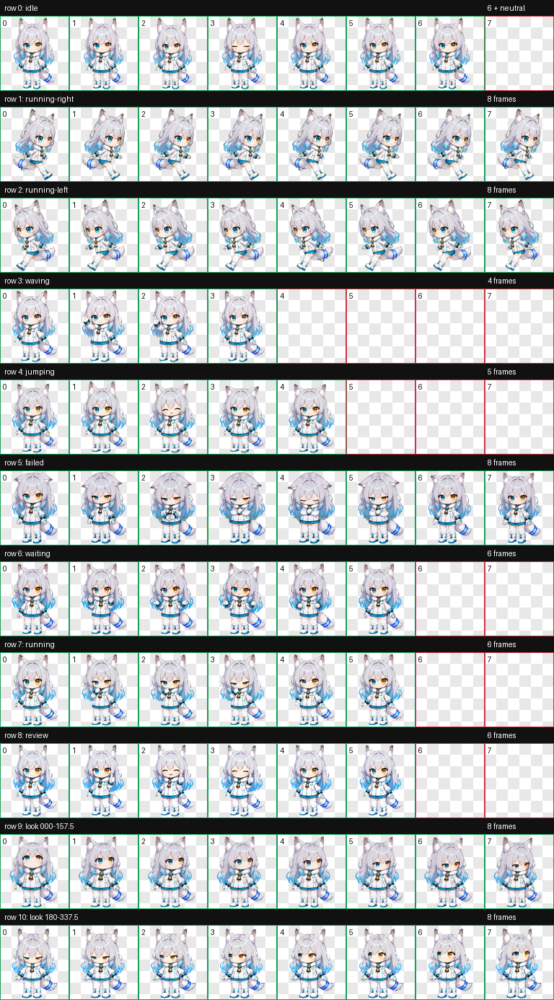
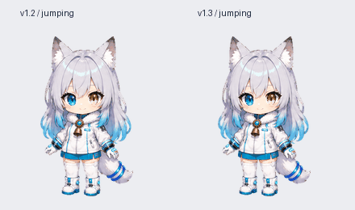

# Linglan（铃澜）— Codex Pet

银发异色瞳、冰蓝科技服装与铃铛的小雪狼桌面宠物。当前发布版：**v1.3**。

## 预览

对照图左侧为 v1.2、右侧为 v1.3。另有[等待输入](preview/waiting-comparison.gif)、[任务执行](preview/running-comparison.gif)、[完成待查看](preview/review-comparison.gif)和[视线方向](preview/look-directions.png)预览。GIF 为动作演示，实际触发和播放方式以 Codex 客户端为准。

## 下载与安装

下载仓库根目录的 [`linglan-codex-pet-v1.3.zip`](linglan-codex-pet-v1.3.zip)，解压后将其中的 `linglan` 文件夹复制到：

- macOS / Linux：`~/.codex/pets/linglan`
- Windows：`%USERPROFILE%\.codex\pets\linglan`

若已安装旧版，请先备份原 `linglan` 文件夹，再替换。也可以直接使用仓库中的 [`linglan/pet.json`](linglan/pet.json) 与 [`linglan/spritesheet.webp`](linglan/spritesheet.webp)。目录结构应为 `pets/linglan/pet.json`，不要多套一层文件夹。随后在 Codex 桌面应用的 **Settings → Pets** 中点 **Refresh**，选择 **Linglan（铃澜）**。回退时恢复备份并再次刷新；旧版压缩包也保留在本仓库。

## v1.3 动作

| 场景 | 客户端动作槽位 | 画面 |
| --- | --- | --- |
| 空闲 | idle | 安静待机，沿用 v1.2 |
| 鼠标移入宠物 | jumping | 双脚保持落地，以轻微抬头和耳朵动作回应，不再跳起 |
| 任务执行 | running | 专注思考，手靠近下巴和衣领 |
| 需要输入或批准 | waiting | 双手轻摊掌询问 |
| 完成、有未读结果 | review | 微笑并给出赞许手势 |
| 失败或受阻 | failed | 沿用失败提示 |
| 向左或向右拖动 | running-left / running-right | 沿用方向移动动作 |
| 临时招呼 | waving | 沿用招呼动作 |

16 个视线方向也沿用 v1.2。动作槽位名称由客户端定义；v1.3 仅更换上述四种动作的画面，不改变官方状态提示、触发优先级、帧时长、循环次数或其他功能。

## 规格与验证

- Codex Pet v2 格式：`spriteVersionNumber: 2`（与作品版本 v1.3 不同）。
- 透明 WebP 图集，1536 × 2288 像素；8 列 × 11 行，每格 192 × 208。
- 包含 9 种标准动作与 16 个视线方向。
- [`qa/`](qa/) 收录图集结构、透明背景、旧版保留行及动作预览的验证摘要。

## 许可与制作

基于用户提供的角色设定图，由 Codex / ChatGPT 协助制作。角色设定、图像和动画保留全部权利；允许个人下载和本地使用。完整约定见 [LICENSE.md](LICENSE.md)。
